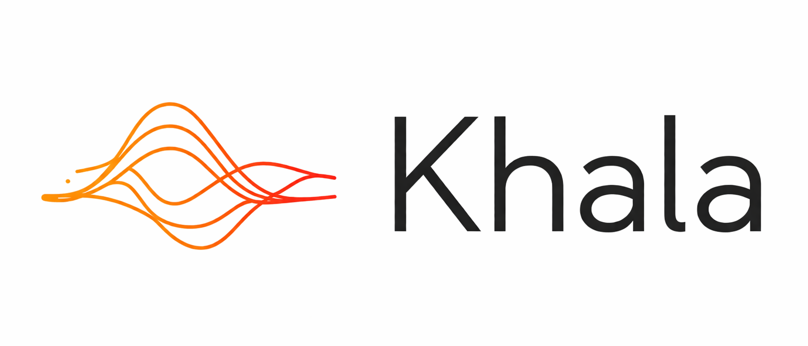
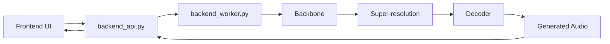

<div align="center">



# High-Fidelity Song Generation With a Unified Acoustic-Token Pipeline

**🍎 Apple Silicon (MPS) fork — run Khala natively on a Mac, no NVIDIA / Docker. [Setup ↓](#apple-silicon)**

English | [中文](./README_zh.md)

</div>

<div align="center">

<a href="https://khala-music-ai.github.io/Khala-demo/">
  
</a>

<a href="https://arxiv.org/abs/2605.01790">
  
</a>

<a href="https://huggingface.co/liujiafeng/Khala-MusicGeneration-v1.0">
  
</a>
<a href="https://huggingface.co/Vinpolar/Khala-MusicGeneration-v1.0-MPS">
  
</a>
<a href="./ENVIRONMENT_SETUP.md">
  
</a>
<a href="./backend/README_backend.md">
  
</a>

</div>

---

## 🍎 About This Fork — Apple Silicon (MPS) Port

> **This is a fork of [Khala](https://github.com/Khala-Music-AI/Khala) whose purpose is to run it natively on Apple Silicon.** It adds a vanilla-PyTorch, **de-Megatron** path so the full backbone → super-resolution → decoder pipeline runs on **Mac (MPS) or CPU** — with **no** NVIDIA GPU, Docker, NGC image, Megatron, TransformerEngine, or FlashAttention. It ships pre-converted weights, a Mac launcher, and a CLI generator, and its numerics match the CUDA reference (backbone greedy decode is bit-identical, 64/64 tokens).

**Get started on a Mac:** 👉 **[Apple Silicon (macOS / MPS) — setup & usage](#apple-silicon)**

| What | Where |
|---|---|
| 🍎 Mac (MPS) weights — **this fork** | [Vinpolar/Khala-MusicGeneration-v1.0-MPS](https://huggingface.co/Vinpolar/Khala-MusicGeneration-v1.0-MPS) |
| ⬆️ Upstream project (original) | [Khala-Music-AI/Khala](https://github.com/Khala-Music-AI/Khala) |
| ⬆️ Upstream weights (original) | [liujiafeng/Khala-MusicGeneration-v1.0](https://huggingface.co/liujiafeng/Khala-MusicGeneration-v1.0) |

> _Everything below this banner is the **upstream** project README (CUDA / Docker / NGC), kept intact for reference. The Mac-specific instructions live in the [Apple Silicon (macOS / MPS)](#apple-silicon) section._

---

## ✨ What Is Khala?

Khala is an open-source system for high-fidelity song generation, capable of generating complete songs from text descriptions and lyric conditions. Unlike approaches built around semantic tokens, diffusion models, or multi-stage audio generation stacks, Khala follows a unified acoustic-token route and generates both coarse musical structure and fine acoustic detail within the same discrete audio representation space.

The core characteristics of Khala include:

- **Full-song generation**: designed for complete song generation rather than short clips or loop-style accompaniment.
- **Text and lyric control**: supports natural-language prompts and lyrics to control style, mood, vocals, and content.
- **Unified acoustic-token representation**: built on a 64-layer RVQ acoustic token hierarchy that represents audio as coarse-to-fine discrete acoustic tokens.
- **Two-stage generation pipeline**: a backbone first generates coarse acoustic tokens, then a super-resolution model completes higher RVQ token layers, and finally a decoder reconstructs the waveform.
- **Complete system implementation**: includes a frontend UI, a FastAPI backend dispatcher, a single-GPU inference worker, model loading, and the end-to-end audio generation path rather than just standalone inference scripts.

## 📰 News

- `⚠️ [2026-05-07]` We have identified a potential issue that may significantly affect inference quality. The problem is currently under investigation and may be related to numerical precision. Until this notice is removed, please treat current generation quality as unstable.

### ✅ Updated

- `[2026-05-31]` Experimental **Apple Silicon (MPS)** support: a vanilla-PyTorch (de-Megatron) inference path runs the full backbone → super-resolution → decoder pipeline on Mac (MPS or CPU), with pre-converted weights, a Mac launcher (`backend/run_backend_mac.sh`), and a CLI generator (`tools/generate_vanilla.py`). See the [Apple Silicon (macOS / MPS)](#apple-silicon) section.
- `[2026-05-16]` The online audio demo page is now available: [Khala Demo](https://khala-music-ai.github.io/Khala-demo/)
- `[2026-05-11]` Backend inference launch now supports single-GPU safe startup by default, plus multi-GPU and runtime-mode overrides for deployment compatibility.
- `[2026-05-05]` The arXiv paper is now available: [Khala: Scaling Acoustic Token Language Models Toward High-Fidelity Music Generation](https://arxiv.org/abs/2605.01790)
- `[2026-05-01]` The codebase, environment documentation, and Dockerfile have been cleaned up for release.

### ⏳ TODOs

- `[Coming Soon]` A full deployment guide for musicians and beginner users.
- `[Coming Soon]` Discord community server.

### 🖥️ Web UI
#### Prompt Mode

#### Tag Mode


### 🎧 Audio Samples

Listen to generated samples on the online demo page: [Khala Demo](https://khala-music-ai.github.io/Khala-demo/)

## ✅ Runtime Requirements

The current release is mainly intended for researchers and developers who are already familiar with GPU servers.

- NVIDIA GPU, with 24GB or more VRAM recommended for the full inference pipeline, such as an RTX 4090 or a higher-tier GPU.
- Docker and NVIDIA Container Toolkit.
- A CUDA-compatible NVIDIA driver.
- Python and Node.js are already included in the prebuilt image.
- Model weights need to be downloaded into the `checkpoints/` directory at the repository root.

> 🍎 **On a Mac?** You do **not** need an NVIDIA GPU, Docker, or the NGC image. See the [🍎 Apple Silicon (macOS / MPS)](#apple-silicon) section for the vanilla-PyTorch path.

## 🚀 Quick Start

This section is intended for researchers and developers who are already comfortable with basic Docker and CUDA workflows, and provides the shortest path to running the system.

If you want to configure the environment step by step from a clean NGC container, please read:

- [ENVIRONMENT_SETUP.md](./ENVIRONMENT_SETUP.md)
- [ENVIRONMENT_SETUP_zh.md](./ENVIRONMENT_SETUP_zh.md)

If you want to understand the backend structure and runtime logic, please read:

- [backend/README_backend.md](./backend/README_backend.md)
- [backend/README_backend_zh.md](./backend/README_backend_zh.md)

### 1. Prepare the runtime environment
The currently available prebuilt image is:
```bash
docker pull ghcr.io/davidliujiafeng/khala-env:ngc25.02-node24

docker run --gpus all -it --rm \
  --name khala \
  -p 30869:30869 \
  -p 8889:8889 \
  ghcr.io/davidliujiafeng/khala-env:ngc25.02-node24
```
> Note: the command above uses `--rm`, so files created inside the container will be removed after the container exits. If you want a long-lived development container or want to keep downloaded model weights, use a mounted directory or remove `--rm`.

### 2. Clone the repository
After entering the container, run:
```bash
cd /workspace
git clone https://github.com/Khala-Music-AI/Khala.git
cd Khala
```

### 3. Download the model checkpoints

Model repository:

- [Hugging Face: liujiafeng/Khala-MusicGeneration-v1.0](https://huggingface.co/liujiafeng/Khala-MusicGeneration-v1.0)

From the repository root, run:

```bash
mkdir -p checkpoints
hf download liujiafeng/Khala-MusicGeneration-v1.0 --local-dir checkpoints
```

This command downloads the model repository contents into the local `checkpoints/` directory.

### 4. Start the backend

```bash
cd /workspace/Khala/backend
bash run_backend.sh
```

The default launcher now starts in a single-GPU safe mode. Advanced users can also select specific GPU ids and switch between `one_shot` and `keep_loaded` runtime modes from the same script; see [backend/README_backend.md](./backend/README_backend.md) for details.

### 5. Start the frontend

In another terminal, run:

```bash
cd /workspace/Khala/frontend
npm install
npm run dev
```

### 6. Open the web UI

Default URL:

- [http://127.0.0.1:30869](http://127.0.0.1:30869)

<a id="apple-silicon"></a>

## 🍎 Apple Silicon (macOS / MPS)

A vanilla-PyTorch, **de-Megatron** port runs the full pipeline (backbone → super-resolution → decoder) on **Apple Silicon (MPS) or CPU** — no Docker, NGC, Megatron, TransformerEngine, or FlashAttention. It is selected at runtime via `KHALA_BACKEND=vanilla`; the CUDA/Megatron path is left untouched. Numerics match the CUDA reference (backbone greedy decode is bit-identical, 64/64 tokens).

> Status: experimental but end-to-end working — it produces coherent, audible music on MPS.

### Requirements

- Apple Silicon Mac (M1 or newer); also runs on CPU.
- A Python virtualenv with `requirements-mac.txt` (pins `torch >= 2.4` for a stable MPS backend). No CUDA stack.
- ~8 GB of unified memory resident for the three models; generation peak is bounded (see [MPS notes](#notes-mps-specifics)).

### 1. Environment

```bash
python3 -m venv .venv-mac
.venv-mac/bin/pip install -r requirements-mac.txt
```

### 2. Weights (pre-converted)

Download the pre-converted MPS weights into `_cuda_artifacts/` (or any directory you point `KHALA_VANILLA_WEIGHTS` at):

```bash
.venv-mac/bin/hf download Vinpolar/Khala-MusicGeneration-v1.0-MPS --local-dir _cuda_artifacts
```

This provides six files: `khala_backbone.safetensors`, `khala_superres.safetensors`, `decoder_weights.pt`, plus `backbone_megatron_args.json`, `superres_megatron_args.json`, and `decoder_config.yaml`.

Prefer to convert them yourself from the original checkpoints? See [`tools/GATHER_RUNBOOK.md`](./tools/GATHER_RUNBOOK.md) — weight extraction is torch-only and needs no NGC image.

### 3a. Generate from the command line

```bash
KHALA_BACKEND=vanilla .venv-mac/bin/python -u tools/generate_vanilla.py --help
KHALA_BACKEND=vanilla .venv-mac/bin/python -u tools/generate_vanilla.py \
    --duration 3 --tags "upbeat, pop, piano, driving drums"
```

`--duration` is in **minutes**; terse comma-separated `--tags` are on-distribution (the model was trained on tag-style metadata, so tags tend to beat free-form sentences). Run with `--help` for all options and examples.

### 3b. Or run the web UI

```bash
bash backend/run_backend_mac.sh          # MPS (use --device cpu to force CPU)
# then, in another terminal:
cd frontend && npm install && npm run dev   # open the printed localhost URL
```

The launcher starts one `keep_loaded` worker (`:8001`) plus the API gateway (`:8889`) with `KHALA_TRACKS_PER_JOB=1`. Stop it with `kill $(cat backend/logs/mac_pids.txt)`.

### Notes (MPS specifics)

- **No FlashAttention on MPS** → `scaled_dot_product_attention` runs the math path = O(S²) memory. The super-resolution attention is instead computed as an exact, **query-chunked** `matmul → softmax → matmul` (block size via `KHALA_ATTN_BLOCK`, default 512), keeping the forward memory flat (≈ 22 GB → ≈ 1 GB at the 8192 ceiling) with bit-exact output. Backbone decoding periodically frees the MPS cache, and super-res is sized to the actual sequence length rather than the training floor.
- **Precision:** fp16 on MPS, fp32 on CPU. The upstream 2026-05-07 precision notice corresponds to a SwiGLU double-bias detail; the port defaults to matching the trained weights (`swiglu_double_bias=True`).
- **Known UI quirk:** the SPA currently burns CPU/GPU while idle-polling during a job (minimizing the browser tab mitigates it); a fix is pending.

## 🧠 System Overview

The current system has three layers:

- Frontend: accepts prompts, lyrics, and generation settings, and displays results.
- API dispatcher: receives requests, creates jobs, queues them, and dispatches them to idle workers.
- Inference worker: runs backbone, super-resolution, and decoder inference.

The request path is:



## 🔗 Project Resources

- Demo page: [Khala Demo](https://khala-music-ai.github.io/Khala-demo/)
- arXiv paper: [Khala: Scaling Acoustic Token Language Models Toward High-Fidelity Music Generation](https://arxiv.org/abs/2605.01790)
- Model weights: https://huggingface.co/liujiafeng/Khala-MusicGeneration-v1.0
- Environment setup: [ENVIRONMENT_SETUP.md](./ENVIRONMENT_SETUP.md)
- Backend docs: [backend/README_backend.md](./backend/README_backend.md)

## 🗂 Repository Structure

```text
Khala/
├── backend/
├── frontend/
├── core/
├── models/
├── checkpoints/
├── assets/
├── Dockerfile
├── requirements.txt
├── ENVIRONMENT_SETUP.md
└── ENVIRONMENT_SETUP_zh.md
```

Main directories:

- `frontend/`: frontend pages and the Vite project.
- `backend/`: backend API, worker, and launcher scripts.
- `core/`: project-specific core modules.
- `models/`: Megatron, decoder, and tokenizer related code.
- `checkpoints/`: model checkpoint directory.
- `assets/`: images used by the README and demo materials.

## 📚 Citation

If this project is helpful to your research or development work, you are welcome to cite our paper:

- [Khala: Scaling Acoustic Token Language Models Toward High-Fidelity Music Generation](https://arxiv.org/abs/2605.01790)

The final BibTeX information will be added later to both the paper page and the repository documentation.

## 🙏 Acknowledgements

The current implementation builds on a number of excellent open-source projects and tools, including but not limited to:

- NVIDIA NGC
- Megatron / Megatron Core
- Hugging Face
- FastAPI
- Vite / React

## 📜 License

The model weights are currently intended to be released under `CC BY-NC 4.0` (Creative Commons Attribution-NonCommercial 4.0 International).

## 💬 Contact

Feel free to join the WeChat group for discussion, usage questions, and future updates:

<div align="center">
  
</div>
